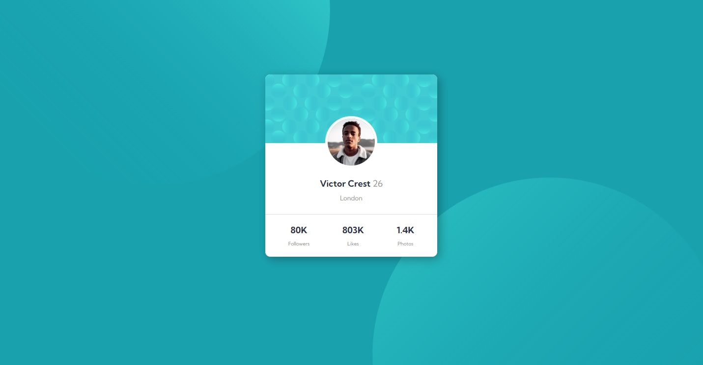

# Solução - Frontend Mentor - Profile Card

Esta é uma resolução para o [profile-card component challenge on Frontend Mentor](https://www.frontendmentor.io/challenges/profile-card-component-cfArpWshJ/hub/profile-card-component-8_gxXdYhD). Frontend Mentor Challenges ajudam você a melhorar suas habilidades de código construindo projetos realistas. 

## Sumário

- [Solução - Frontend Mentor - Profile Card](#solução---frontend-mentor---profile-card)
  - [Sumário](#sumário)
  - [Resumo](#resumo)
    - [Screenshot](#screenshot)
    - [Links](#links)
    - [Desenvolvido com](#desenvolvido-com)
  - [Autor](#autor)

## Resumo
Projeto desenvolvido para treino e auxílio no desenvolvimento das habilidades com HTML e CSS.

### Screenshot

### Links
- Endereço da Solução: [Respositório em meu GitHub](https://github.com/juniorrdgs/profile-component)

### Desenvolvido com
- HTML5
- CSS puro
- Flexbox
- Media Query

## Autor

- Github Pages - [Junior Rodrigues](https://juniorrdgs.github.io)
- Frontend Mentor - [@juniorrdgs](https://www.frontendmentor.io/profile/juniorrdgs)